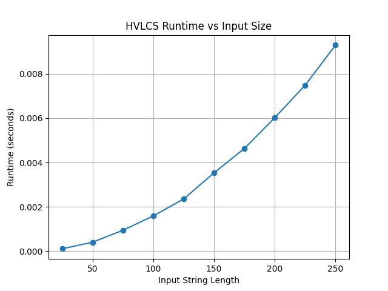

# PA3-Dynamic-Programming
COP4533 Programming 3 Assignment

# Team
Jennifer Zheng: 52838059  
Srinitha Srikanth: 55178917

# Compile/Build
N/A

# How to Run
N/A

# Assumptions/Dependencies
The main algorithm uses Python Standard Library (sys). External libraries like matplotlib are only needed for the running the grapher to generate the graph in Question 1.  
  
  Input Files Format:  
  `K`  
  `x1 v1`  
  `x2 v2`  
  `...`  
  `xK vK`  
  `A`  
  `B`  
    
    Output files will have a single integer on one line which is the max value of common subsequence of A and B. On the next line is one optimal common subsequence that achieves this value.  
      
      Output file Format:  
      `9`  
      `cb`

# Question 1: Empirical Comparison

# Question 2: Recurrence Equation
N/A

# Question 3: Big-Oh